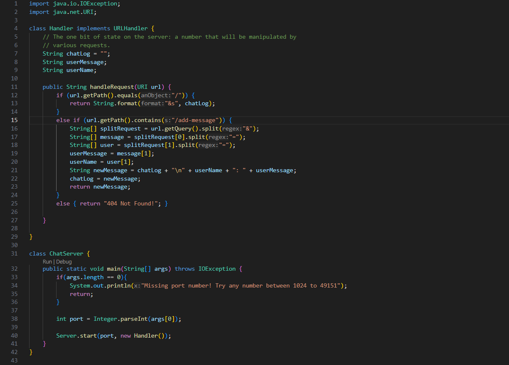

# CSE 15L - Lab Report 2 - Dylan Williams

For this lab report, I used some of the code from the lab during week 2, specifically the `NumberServer.java` file, which I edited for the purposes of this lab, and the `Server.java` file.

Here is my edited version, called `ChatServer` where I made changes to the `handlerequest()` method:

