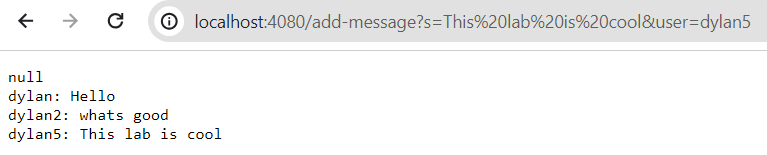
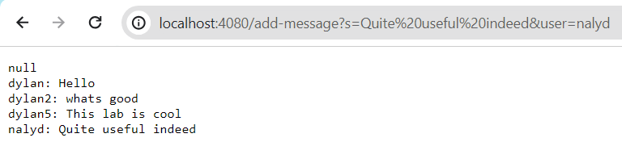

# CSE 15L - Lab Report 2 - Dylan Williams

For this lab report, I used some of the code from the lab during week 2, specifically the `NumberServer.java` file, which I edited for the purposes of this lab, and the `Server.java` file.

Here is my edited version, called `ChatServer` where I made changes to the `handleRequest()` method:

Following this sentence are two screenshots displaying my testing of the server and the code's functionality from the URL line:

For this test, the `handleRequest()` method is called. Relevant arguments in the URL line are `This lab is cool` and `dylan5`. Relevant fields include the `String[]` fields: `splitRequest`, `message`, and `user`, as well as `String` fields `message`, `user`, `newMessage`, and `chatLog`. The values change according to how the code splits each of the arguments, and ultimately `chatLog` is saving the history of previous messages before the most recent run of the code.

For this test, the `handleRequest()` method is called. Relevant arguments in the URL line are `Quite useful indeed` and `nalyd`. Relevant fields include the `String[]` fields: `splitRequest`, `message`, and `user`, as well as `String` fields `message`, `user`, `newMessage`, and `chatLog`. The values change according to how the code splits each of the arguments, and ultimately `chatLog` is saving the history of previous messages before the most recent run of the code.

In this lab, I learned that I can code a server that can be changed from the URL line, which is convenient as I don't have to interact with the code any further for the server's contents to update.
