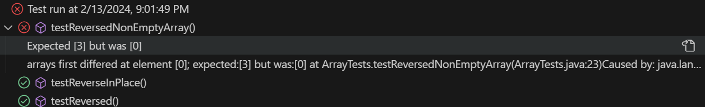

# CSE 15L Lab Report 3 - Dylan Williams
## Part 1 - Bugs
Below is failure-inducing input for the buggy program, as a code block of a JUnit test.
```
  @Test
  public void testReversedNonEmptyArray() {
    int[] input1 = new int[]{1, 2, 3};
    assertArrayEquals(new int[]{3, 2, 1}, ArrayExamples.reversed(input1));
  }
```
Below is an input that doesn't induce a failure, as a code block of a JUnit test.
```
  @Test
  public void testReversed() {
    int[] input1 = { };
    assertArrayEquals(new int[]{ }, ArrayExamples.reversed(input1));
  }
```
Below is the symptom, as the output of running the tests.

Below is the bug, as the before-and-after code change required to fix it. 

**Before:**
```
static int[] reversed(int[] arr) {
    int[] newArray = new int[arr.length];
    for(int i = 0; i < arr.length; i += 1) {
      arr[i] = newArray[arr.length - i - 1];
    }
    return arr;
  }
```
**After:**
```
static int[] reversed(int[] arr) {
    int[] newArray = new int[arr.length];
    for(int i = 0; i < arr.length; i += 1) {
      newArray[i] = arr[arr.length - i - 1];
    }
    return newArray;
  }
```
The second block of code fixes the issue because the elements starting from index `0` of `newArray` are now being assigned as the elements starting from index `arr.length - 1` of `arr` going backwards.

## Part 2 - Researching Commands


