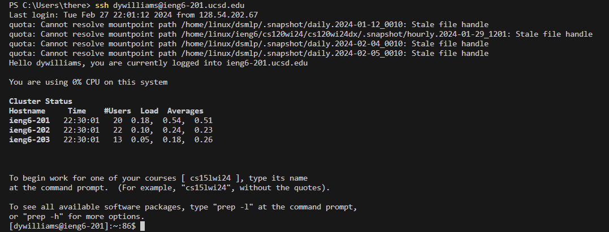
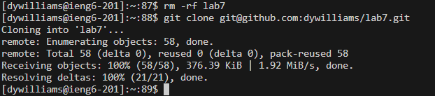
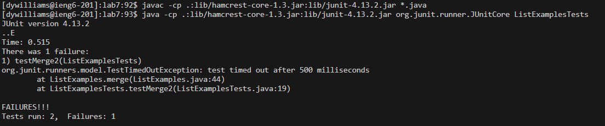
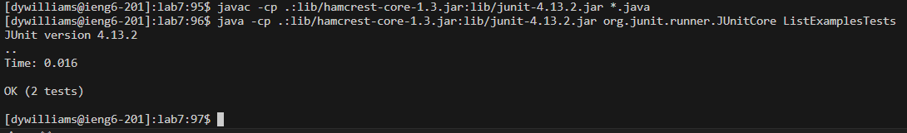
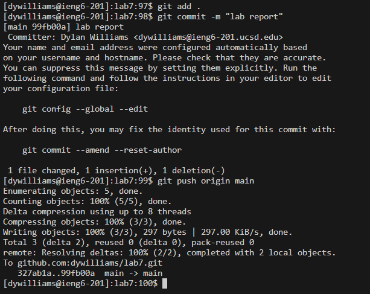

# CSE 15L - Lab Report 4 - Dylan Williams
## Step 4 - Log into ieng6

This step is me logging in to ieng6, I had the `ssh` login line in my history, so I only had to up arrow to input it again.

**Keys pressed:** `<up><enter>`

---

## Step 5 - Clone your fork of the repository from your Github account (using the SSH URL)

**Keys pressed:** `<right-click><ctrl-a>git clone<enter>` 

I already had the `ssh` link from GitHub copied, so I just right-clicked in the terminal to paste. Then I used a shortcut to move the cursor to the front of the line, where I typed `git clone` to finish the line before entering.

---

## Step 6 - Run the tests, demonstrating that they fail

**Keys pressed:** `ls<enter>`,`cd lab7<enter>`,`<up><up><up><up><enter>`,`<up><up><up><up><up><up><up><up><up><up><up><up><up><up><enter>`

I used `ls` and `cd` to make sure I was in the correct directory to proceed. I then pressed my up key several times to access the commands in my history to both compile the code and run the test file.

---

## Step 7 - Edit the code file to fix the failing test

**Keys pressed:** `vim L<tab>.java<enter>`,`43jer2<:wq><enter>`

I typed a vim command, using the tab key to help finish typing the file name, so I could edit the file with the error. I then typed the number of the line before the motion key `j` so I could get to the correct line, as I started with my cursor at the top of the file. After using `e` to get to the correct character, `r2` replaced the character with `2`, and then I saved the file and exited using `:wq`.

---

## Step 8 - Run the tests, demonstrating that they now succeed

**Keys pressed:** `<up><up><up><enter>`,`<up><up><up><enter>`

I once again accessed the commands to compile and run by using up arrow until I found the desired line, before entering.

---

## Step 9 - Commit and push the resulting change to your Github account (you can pick any commit message!)

**Keys pressed:** `git add .<enter>`,`git commit -m "lab report"<enter>`,`git push origin main<enter>`

Because I had used this method before, I found it reliable to use these same three lines to ensure a proper commit and push to GitHub.

