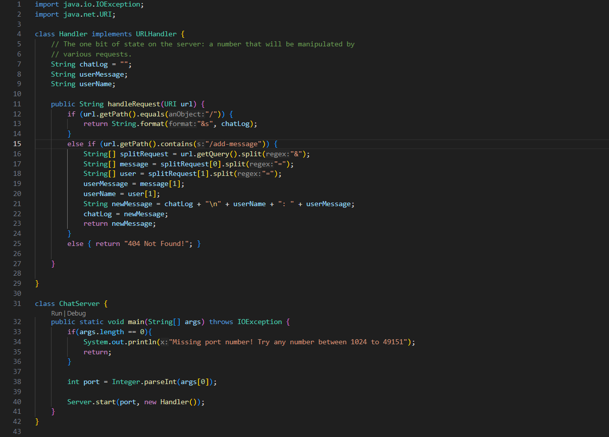

# CSE 15L - Lab Report 5 - Dylan Williams
## Issue with ChatServer history
**Dylan Williams:**
Hello!
I am having an issue with the functionality of my ChatServer.
The expected behavior of my ChatServer when the URL path simply ends with `/` (no adding message or saving afterwards) is that chat history will be displayed.
The chat history is saved in a variable `chatLog` in my code, which I will display below an image of the symptom in the images below.
*Note that I am observing behavior from my browser so the `/` by itself will not be visible.*

Here is the expected output: 


Here is the actual output:


Here is the code:


My bash script to run and start the server is as follows:
```
javac ChatServer.java Server.java
java ChatServer $1
```


**CSE 15L Helpful TA:**
Hello, it seems from your code that there is a reason your code may not be functioning as intended.
I recommend pondering what the purpose of the `.printf` method is used for, and if it is necessary at all in this case. 
You could also try experimenting with `printf` in a separate java file and using a similar bash script to observe the output.


